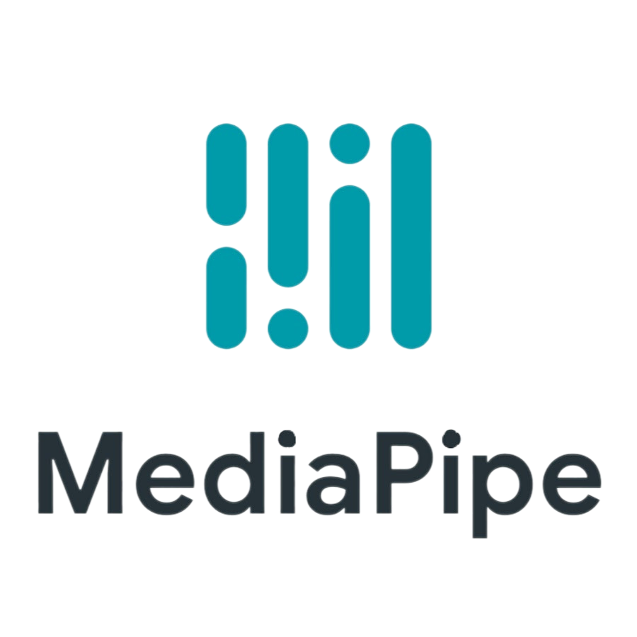
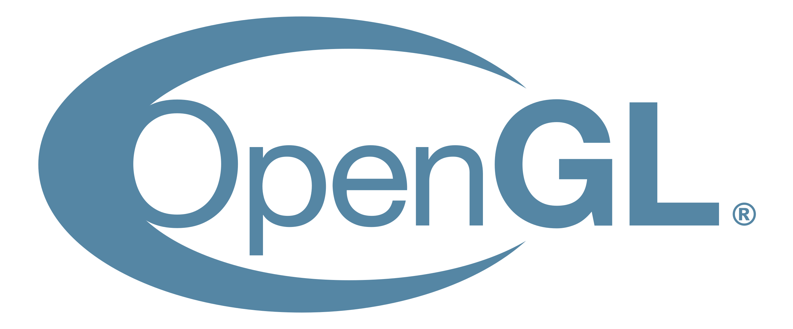

# 3D Gesture Control

3D Gesture Control est une application conçue pour permettre la manipulation intuitive d'objets 3D en utilisant des gestes simples et ergonomiques détectés par la caméra de l'ordinateur.

## Introduction

L'évolution constante des interfaces interactives ouvre de nouvelles possibilités d'interaction entre les humains et les machines. Ces avancées reflètent une transition vers des systèmes plus intuitifs et immersifs, où les gestes naturels deviennent le principal moyen de communication. Dans ce contexte, notre projet se concentre sur le développement d'une interface basée sur les gestes pour la manipulation intuitive de modèles 3D.

## Technologies Utilisées

- **OpenCV** : Pour la capture d'image de la webcam.
- **MediaPipe** : Pour la détection de main et la reconnaissance de gestes à l'aide de modèles pré-entraînés.
- **Pygame** et **OpenGL** : Pour l'affichage et la manipulation des modèles 3D.

  
  
  
  

## Fonctionnalités

1. **Détection de Main** : Utilisation de MediaPipe pour détecter les mains dans le flux vidéo de la webcam.
2. **Extraction des Landmarks** : Extraction des points de repère des mains détectées.
3. **Classification des Landmarks** : Classification des landmarks pour reconnaître les gestes effectués par l'utilisateur.
4. **Application des Fonctions sur le Modèle 3D** : En fonction des gestes détectés, des actions appropriées sont appliquées sur le modèle 3D (translation, rotation, zoom, etc.).

## Installation

1. Clonez le dépôt GitHub sur votre machine locale.
2. Lancez l'application en exécutant `app.py`.

## Contribution

Les contributions sont les bienvenues ! Si vous souhaitez contribuer à ce projet, veuillez créer une pull request avec vos modifications.

## Auteurs

Ce projet a été développé par Maëva Desbats, Clément Coutant et Thomas Strinati.
